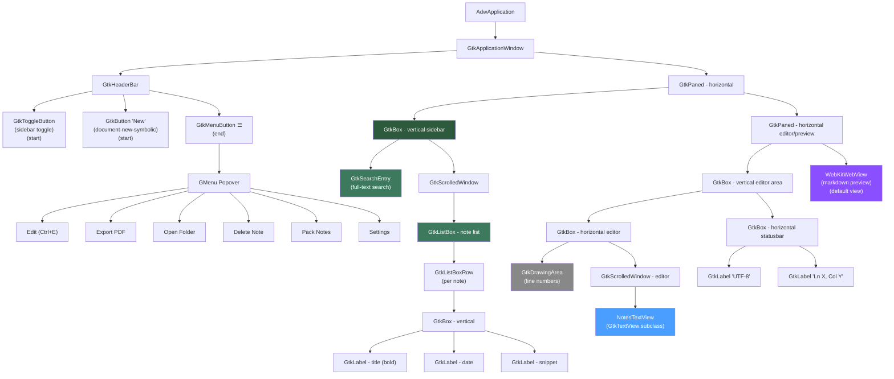
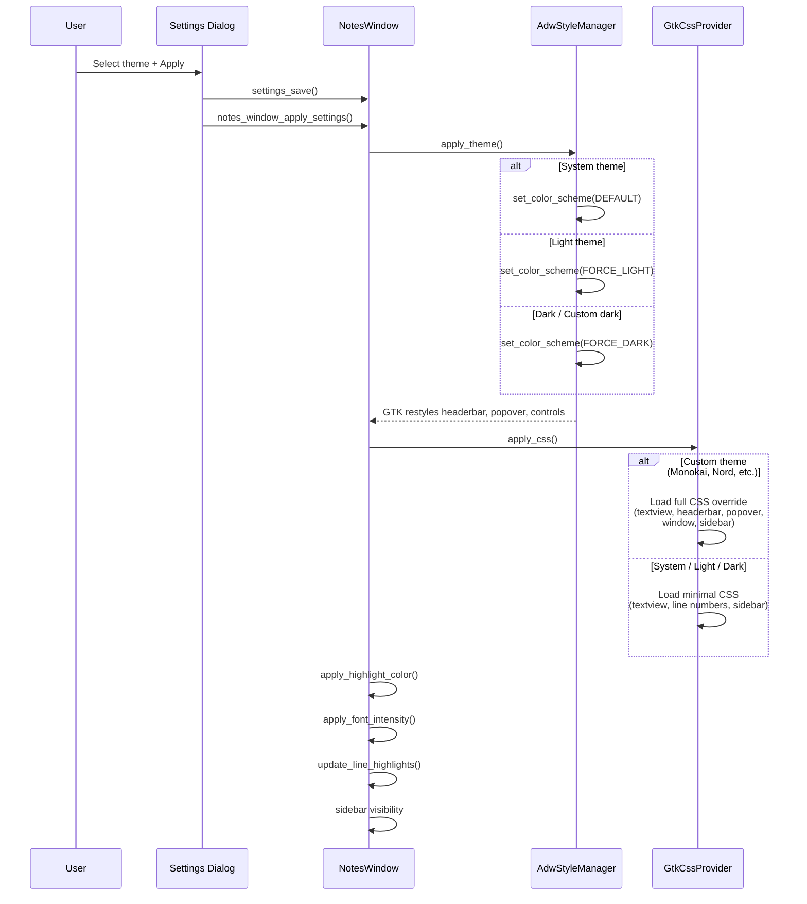
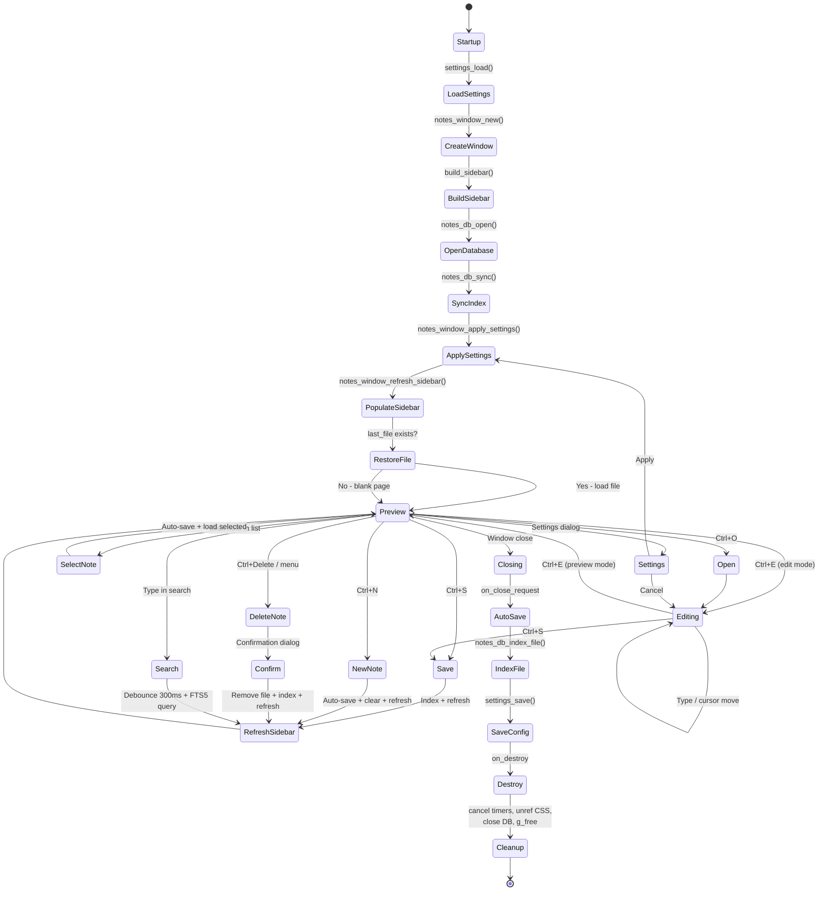
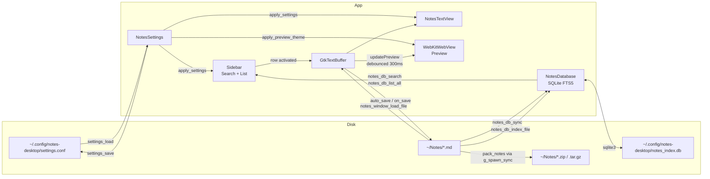
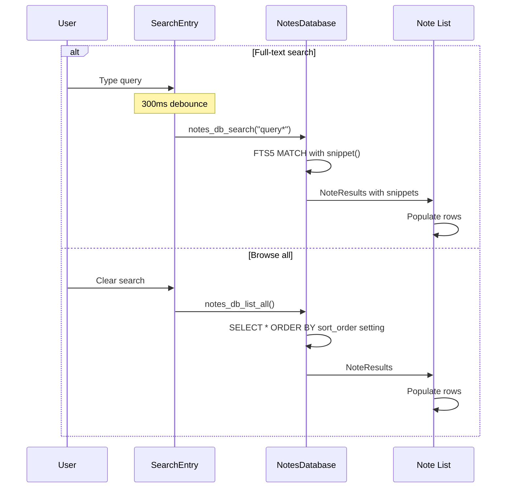
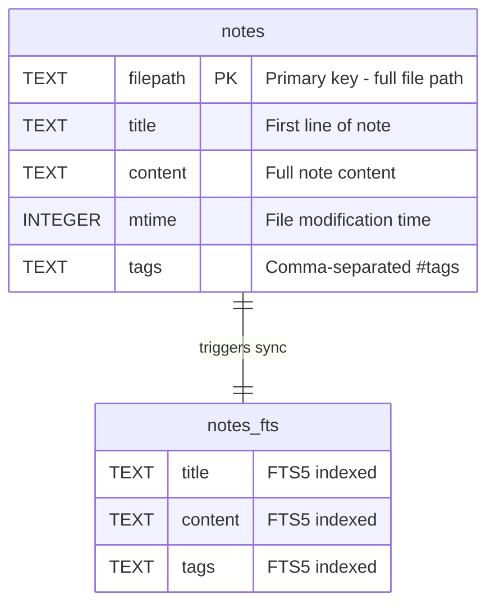

# Diagrams

## Widget Hierarchy

```mermaid
graph TD
    A[AdwApplication] --> B[GtkApplicationWindow]
    B --> C[GtkHeaderBar]
    B --> P[GtkPaned - horizontal]

    C --> C0["GtkToggleButton<br/>(sidebar toggle)<br/>(start)"]
    C --> C4["GtkButton 'New'<br/>(document-new-symbolic)<br/>(start)"]
    C --> C2["GtkMenuButton ☰<br/>(end)"]
    C2 --> C3[GMenu Popover]
    C3 --> C3e["Edit (Ctrl+E)"]
    C3 --> C3f["Export PDF"]
    C3 --> C3a["Open Folder"]
    C3 --> C3d["Delete Note"]
    C3 --> C3b["Pack Notes"]
    C3 --> C3c["Settings"]

    P --> SB[GtkBox - vertical sidebar]
    P --> PP[GtkPaned - horizontal editor/preview]
    PP --> EV[GtkBox - vertical editor area]
    PP --> WK["WebKitWebView<br/>(markdown preview)<br/>(default view)"]

    SB --> SE["GtkSearchEntry<br/>(full-text search)"]
    SB --> LS[GtkScrolledWindow]
    LS --> LB[GtkListBox - note list]
    LB --> LR["GtkListBoxRow<br/>(per note)"]
    LR --> NB["GtkBox - vertical"]
    NB --> NT["GtkLabel - title (bold)"]
    NB --> ND["GtkLabel - date"]
    NB --> NS["GtkLabel - snippet"]

    EV --> E[GtkBox - horizontal editor]
    EV --> F[GtkBox - horizontal statusbar]

    E --> G["GtkDrawingArea<br/>(line numbers)"]
    E --> H[GtkScrolledWindow - editor]

    H --> H1["NotesTextView<br/>(GtkTextView subclass)"]

    F --> F1["GtkLabel 'UTF-8'"]
    F --> F2["GtkLabel 'Ln X, Col Y'"]

    style H1 fill:#4a9eff,color:#fff
    style G fill:#888,color:#fff
    style WK fill:#8a4fff,color:#fff
    style SB fill:#2d5a3d,color:#fff
    style SE fill:#3d7a5d,color:#fff
    style LB fill:#3d7a5d,color:#fff
```

## Theme Switching Flow

```mermaid
sequenceDiagram
    participant U as User
    participant D as Settings Dialog
    participant W as NotesWindow
    participant SM as AdwStyleManager
    participant CSS as GtkCssProvider

    U->>D: Select theme + Apply
    D->>W: settings_save()
    D->>W: notes_window_apply_settings()
    W->>SM: apply_theme()

    alt System theme
        SM->>SM: set_color_scheme(DEFAULT)
    else Light theme
        SM->>SM: set_color_scheme(FORCE_LIGHT)
    else Dark / Custom dark
        SM->>SM: set_color_scheme(FORCE_DARK)
    end

    SM-->>W: GTK restyles headerbar, popover, controls

    W->>CSS: apply_css()

    alt Custom theme (Monokai, Nord, etc.)
        CSS->>CSS: Load full CSS override<br/>(textview, headerbar, popover,<br/>window, sidebar)
    else System / Light / Dark
        CSS->>CSS: Load minimal CSS<br/>(textview, line numbers, sidebar)
    end

    W->>W: apply_highlight_color()
    W->>W: apply_font_intensity()
    W->>W: update_line_highlights()
    W->>W: sidebar visibility
```

## Application Lifecycle

```mermaid
stateDiagram-v2
    [*] --> Startup
    Startup --> LoadSettings: settings_load()
    LoadSettings --> CreateWindow: notes_window_new()
    CreateWindow --> BuildSidebar: build_sidebar()
    BuildSidebar --> OpenDatabase: notes_db_open()
    OpenDatabase --> SyncIndex: notes_db_sync()
    SyncIndex --> ApplySettings: notes_window_apply_settings()
    ApplySettings --> PopulateSidebar: notes_window_refresh_sidebar()
    PopulateSidebar --> RestoreFile: last_file exists?

    RestoreFile --> Preview: Yes - load file
    RestoreFile --> Preview: No - blank page

    Preview --> Editing: Ctrl+E (edit mode)
    Editing --> Preview: Ctrl+E (preview mode)

    Preview --> Save: Ctrl+S
    Preview --> Open: Ctrl+O
    Preview --> NewNote: Ctrl+N
    Preview --> DeleteNote: Ctrl+Delete / menu
    Preview --> Search: Type in search
    Preview --> SelectNote: Click note in list
    Preview --> Settings: Settings dialog
    Preview --> Closing: Window close

    Editing --> Editing: Type / cursor move
    Editing --> Save: Ctrl+S

    Save --> RefreshSidebar: Index + refresh
    Open --> Editing
    NewNote --> RefreshSidebar: Auto-save + clear + refresh
    DeleteNote --> Confirm: Confirmation dialog
    Confirm --> RefreshSidebar: Remove file + index + refresh
    Search --> RefreshSidebar: Debounce 300ms + FTS5 query
    SelectNote --> Preview: Auto-save + load selected
    RefreshSidebar --> Preview

    Settings --> ApplySettings: Apply
    Settings --> Editing: Cancel

    Closing --> AutoSave: on_close_request
    AutoSave --> IndexFile: notes_db_index_file()
    IndexFile --> SaveConfig: settings_save()
    SaveConfig --> Destroy: on_destroy
    Destroy --> Cleanup: cancel timers, unref CSS,<br/>close DB, g_free
    Cleanup --> [*]
```

## Data Flow

```mermaid
flowchart LR
    subgraph Disk
        CF[~/.config/notes-desktop/settings.conf]
        DB[~/.config/notes-desktop/notes_index.db]
        NF[~/Notes/*.md]
        AR[~/Notes/*.zip / .tar.gz]
    end

    subgraph App
        S[NotesSettings]
        IDX[NotesDatabase<br/>SQLite FTS5]
        B[GtkTextBuffer]
        TV[NotesTextView]
        PV[WebKitWebView<br/>Preview]
        SB[Sidebar<br/>Search + List]
    end

    CF -->|settings_load| S
    S -->|settings_save| CF

    NF -->|notes_db_sync| IDX
    NF -->|notes_window_load_file| B
    B -->|auto_save / on_save| NF
    NF -->|notes_db_index_file| IDX
    NF -->|pack_notes via g_spawn_sync| AR

    IDX -->|notes_db_search<br/>notes_db_list_all| SB
    IDX <-->|sqlite3| DB

    S -->|apply_settings| TV
    S -->|apply_settings| SB
    S -->|apply_preview_theme| PV
    B --> TV
    B -->|updatePreview<br/>debounced 300ms| PV
    SB -->|row activated| B
```

## Search Flow

```mermaid
sequenceDiagram
    participant U as User
    participant SE as SearchEntry
    participant DB as NotesDatabase
    participant LB as Note List

    alt Full-text search
        U->>SE: Type query
        Note over SE: 300ms debounce
        SE->>DB: notes_db_search("query*")
        DB->>DB: FTS5 MATCH with snippet()
        DB->>LB: NoteResults with snippets
        LB->>LB: Populate rows
    else Browse all
        U->>SE: Clear search
        SE->>DB: notes_db_list_all()
        DB->>DB: SELECT * ORDER BY sort_order setting
        DB->>LB: NoteResults
        LB->>LB: Populate rows
    end
```

## Database Schema

```mermaid
erDiagram
    notes {
        TEXT filepath PK "Primary key - full file path"
        TEXT title "First line of note"
        TEXT content "Full note content"
        INTEGER mtime "File modification time"
        TEXT tags "Comma-separated #tags"
    }

    notes_fts {
        TEXT title "FTS5 indexed"
        TEXT content "FTS5 indexed"
        TEXT tags "FTS5 indexed"
    }

    notes ||--|| notes_fts : "triggers sync"
```

## Settings Dialog Layout

```mermaid
graph TD
    subgraph Settings Window - GtkNotebook
        subgraph General Tab
            A[Theme - GtkDropDown<br/>13 themes]
            B[Font - GtkFontDialogButton]
            B2[Sidebar Font - GtkFontDialogButton]
            B3[GUI Font - GtkFontDialogButton]
            C[Font Intensity - GtkScale<br/>0.3 - 1.0]
            D[Line Spacing - GtkDropDown<br/>1 / 1.2 / 1.5 / 2]
            E[Line Numbers - GtkCheckButton]
            F[Highlight Line - GtkCheckButton]
            F2[Wrap Lines - GtkCheckButton]
            G[Archive Format - GtkDropDown<br/>ZIP / tar.gz / tar.xz]
            H[Delete After Pack - GtkCheckButton]
            H2[Confirm Dialogs - GtkCheckButton]
            H3[Sort Order - GtkDropDown]
            I[Save Directory - GtkButton]
        end
        subgraph PDF Tab
            P1[Margin Top - GtkSpinButton mm]
            P2[Margin Bottom - GtkSpinButton mm]
            P3[Margin Left - GtkSpinButton mm]
            P4[Margin Right - GtkSpinButton mm]
            P5[Landscape - GtkCheckButton]
            P6[Page Numbers - GtkDropDown<br/>None / Page / Page+Total]
        end
        J[Cancel / Apply buttons]
    end

    A --> B --> B2 --> B3 --> C --> D --> E --> F --> F2 --> G --> H --> H2 --> H3 --> I
    P1 --> P2 --> P3 --> P4 --> P5 --> P6
```
