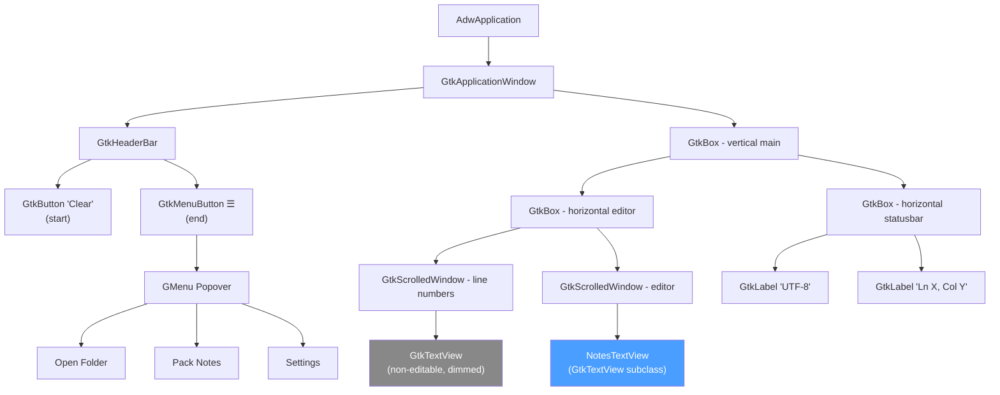
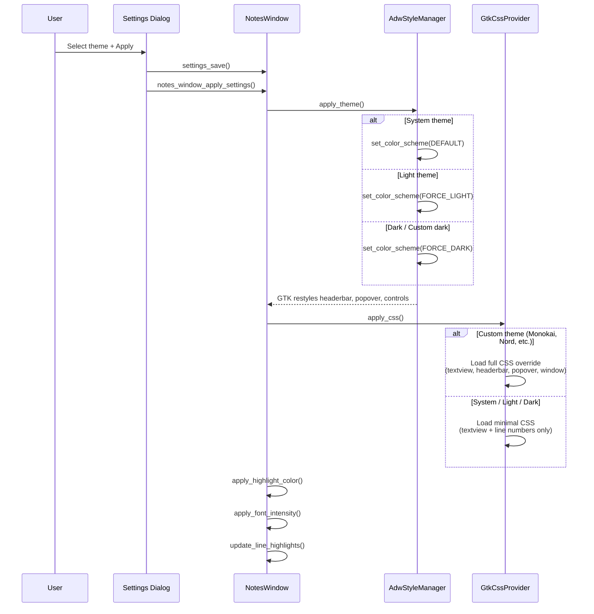
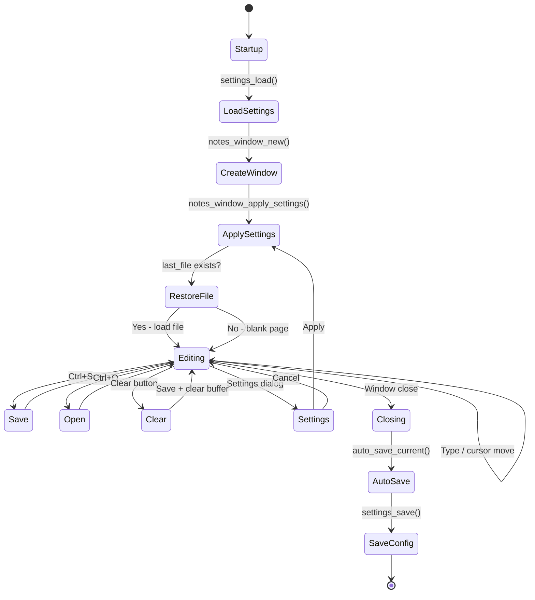
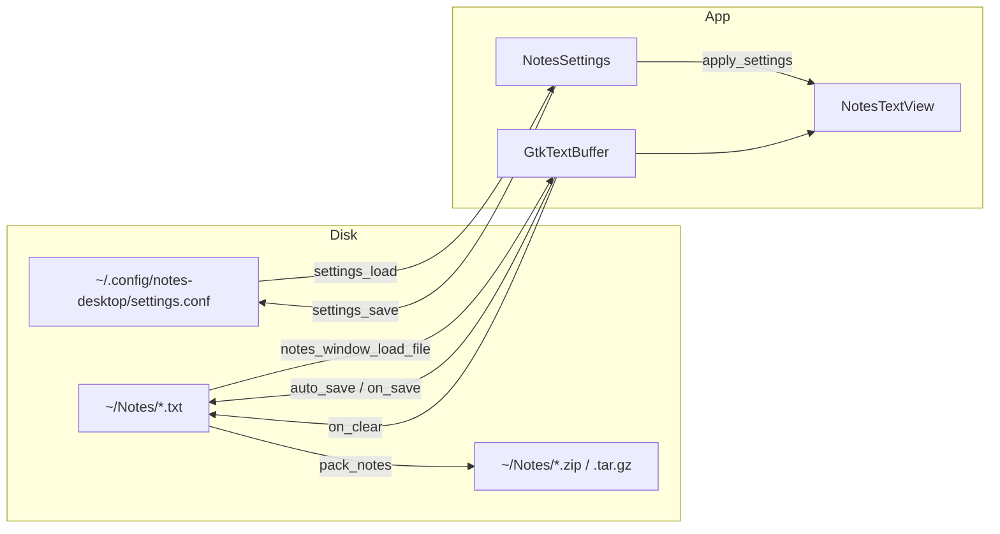

# Diagrams

## Widget Hierarchy

```mermaid
graph TD
    A[AdwApplication] --> B[GtkApplicationWindow]
    B --> C[GtkHeaderBar]
    B --> D[GtkBox - vertical main]

    C --> C1["GtkButton 'Clear'<br/>(start)"]
    C --> C2["GtkMenuButton ☰<br/>(end)"]
    C2 --> C3[GMenu Popover]
    C3 --> C3a["Open Folder"]
    C3 --> C3b["Pack Notes"]
    C3 --> C3c["Settings"]

    D --> E[GtkBox - horizontal editor]
    D --> F[GtkBox - horizontal statusbar]

    E --> G[GtkScrolledWindow - line numbers]
    E --> H[GtkScrolledWindow - editor]

    G --> G1["GtkTextView<br/>(non-editable, dimmed)"]
    H --> H1["NotesTextView<br/>(GtkTextView subclass)"]

    F --> F1["GtkLabel 'UTF-8'"]
    F --> F2["GtkLabel 'Ln X, Col Y'"]

    style H1 fill:#4a9eff,color:#fff
    style G1 fill:#888,color:#fff
```

## Theme Switching Flow

```mermaid
sequenceDiagram
    participant U as User
    participant D as Settings Dialog
    participant W as NotesWindow
    participant SM as AdwStyleManager
    participant CSS as GtkCssProvider

    U->>D: Select theme + Apply
    D->>W: settings_save()
    D->>W: notes_window_apply_settings()
    W->>SM: apply_theme()

    alt System theme
        SM->>SM: set_color_scheme(DEFAULT)
    else Light theme
        SM->>SM: set_color_scheme(FORCE_LIGHT)
    else Dark / Custom dark
        SM->>SM: set_color_scheme(FORCE_DARK)
    end

    SM-->>W: GTK restyles headerbar, popover, controls

    W->>CSS: apply_css()

    alt Custom theme (Monokai, Nord, etc.)
        CSS->>CSS: Load full CSS override<br/>(textview, headerbar, popover, window)
    else System / Light / Dark
        CSS->>CSS: Load minimal CSS<br/>(textview + line numbers only)
    end

    W->>W: apply_highlight_color()
    W->>W: apply_font_intensity()
    W->>W: update_line_highlights()
```

## Application Lifecycle

```mermaid
stateDiagram-v2
    [*] --> Startup
    Startup --> LoadSettings: settings_load()
    LoadSettings --> CreateWindow: notes_window_new()
    CreateWindow --> ApplySettings: notes_window_apply_settings()
    ApplySettings --> RestoreFile: last_file exists?

    RestoreFile --> Editing: Yes - load file
    RestoreFile --> Editing: No - blank page

    Editing --> Editing: Type / cursor move
    Editing --> Save: Ctrl+S
    Editing --> Open: Ctrl+O
    Editing --> Clear: Clear button
    Editing --> Settings: Settings dialog
    Editing --> Closing: Window close

    Save --> Editing
    Open --> Editing
    Clear --> Editing: Save + clear buffer

    Settings --> ApplySettings: Apply
    Settings --> Editing: Cancel

    Closing --> AutoSave: auto_save_current()
    AutoSave --> SaveConfig: settings_save()
    SaveConfig --> [*]
```

## Data Flow

```mermaid
flowchart LR
    subgraph Disk
        CF[~/.config/notes-desktop/settings.conf]
        NF[~/Notes/*.txt]
        AR[~/Notes/*.zip / .tar.gz]
    end

    subgraph App
        S[NotesSettings]
        B[GtkTextBuffer]
        TV[NotesTextView]
    end

    CF -->|settings_load| S
    S -->|settings_save| CF

    NF -->|notes_window_load_file| B
    B -->|auto_save / on_save| NF
    B -->|on_clear| NF

    NF -->|pack_notes| AR

    S -->|apply_settings| TV
    B --> TV
```

## Settings Dialog Layout

```mermaid
graph TD
    subgraph Settings Window
        A[Theme - GtkDropDown<br/>13 themes]
        B[Font - GtkFontDialogButton]
        C[Font Intensity - GtkScale<br/>0.3 - 1.0]
        D[Line Spacing - GtkDropDown<br/>1 / 1.2 / 1.5 / 2]
        E[Line Numbers - GtkCheckButton]
        F[Highlight Line - GtkCheckButton]
        F2[Wrap Lines - GtkCheckButton]
        G[Archive Format - GtkDropDown<br/>ZIP / tar.gz / tar.xz]
        H[Delete After Pack - GtkCheckButton]
        I[Save Directory - GtkButton → FileDialog]
        J[Cancel / Apply buttons]
    end

    A --> B --> C --> D --> E --> F --> F2 --> G --> H --> I --> J
```
